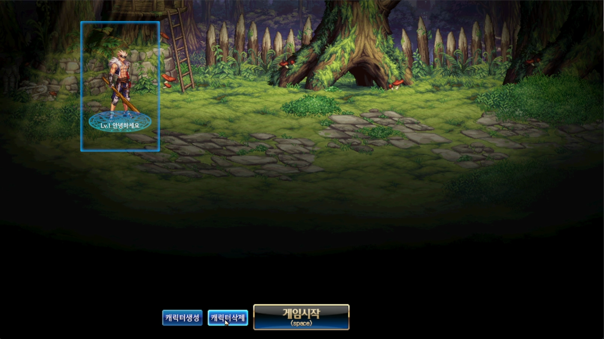
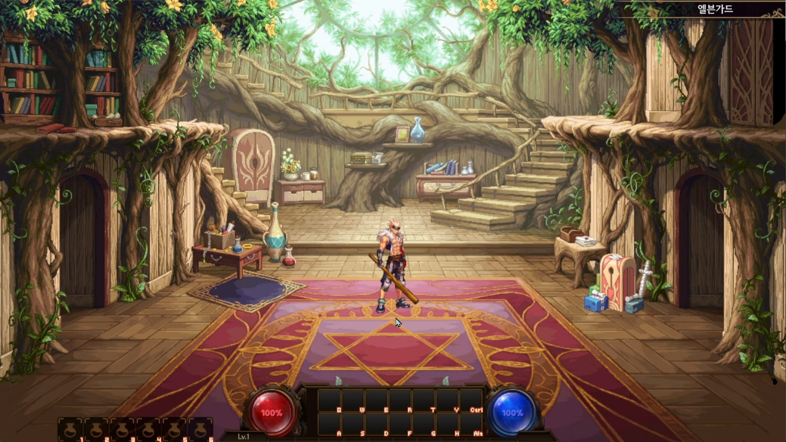
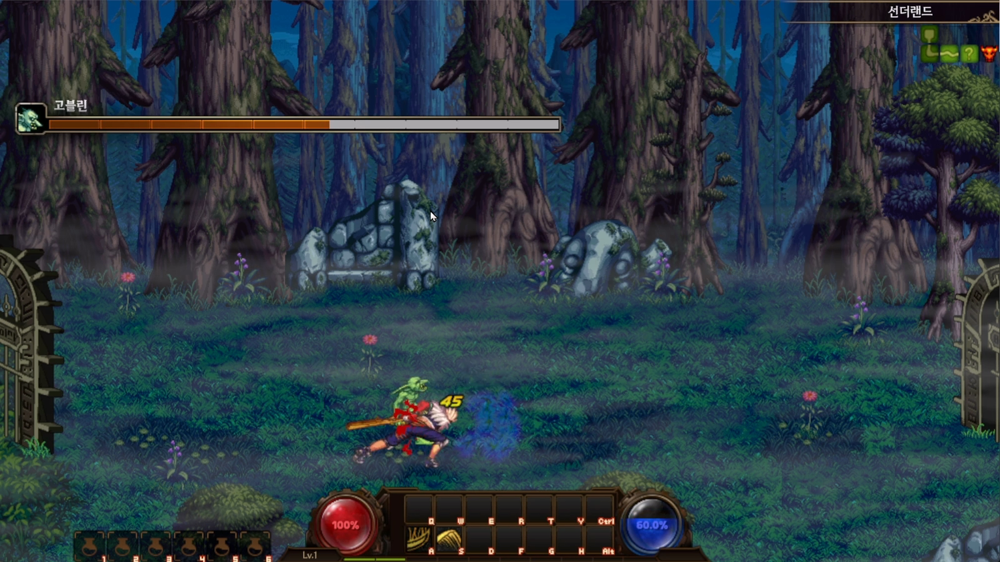
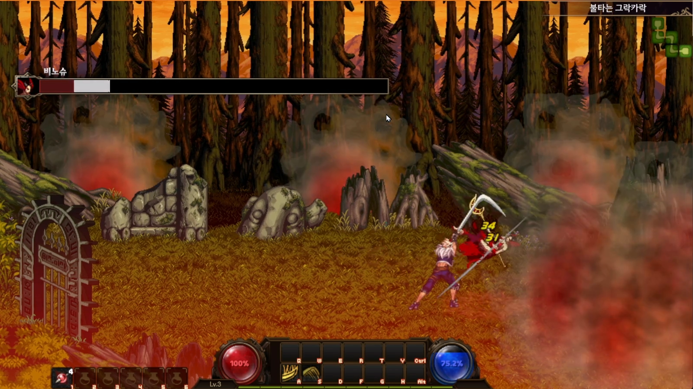
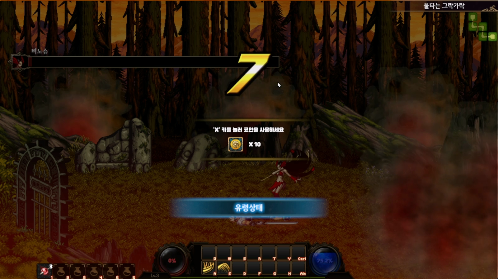
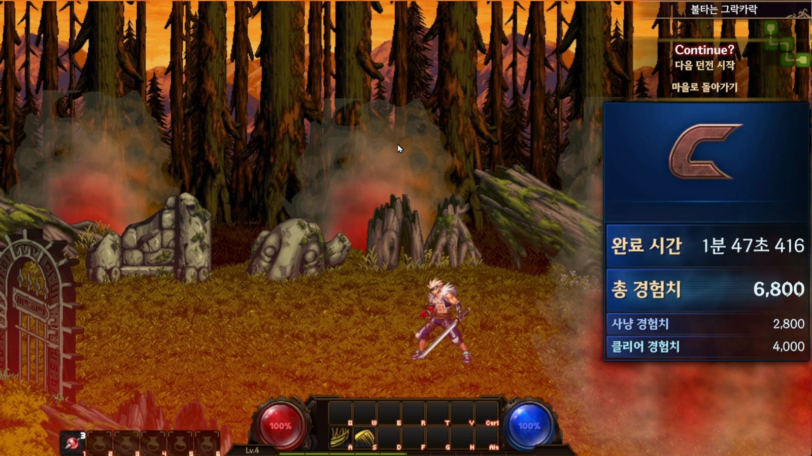
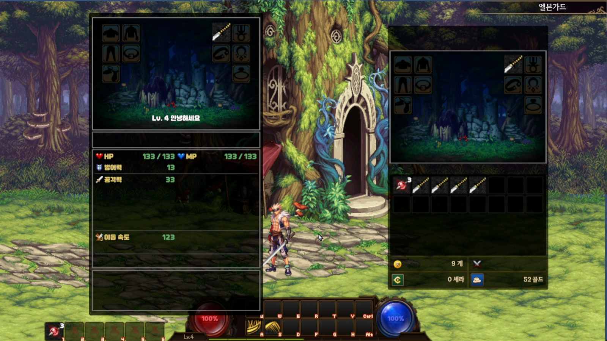

# DNF-Copy — 2D 액션게임 ‘던전앤파이터’ 모작

## 프로젝트 소개

던전앤파이터의 2D 액션 코어(입력 버퍼·콤보·히트박스 등)를 Unity로 재현하고자 한 개인 포트폴리오 프로젝트입니다.

## 프로젝트 개요

- 개발 기간: 2개월
- 인원/역할: 1인 (프로그래밍)
- 장르/플랫폼: 2D 액션 / PC (Windows)
- 개발 동기: 2D 액션 타격감의 핵심 메커닉을 설계·구현하고, 유지보수 가능한 구조(입력-전투-UI)를 수립

## 사용 기술

- 엔진/환경: Unity 6000.1.4f1
- 언어/패키지: C#, UniTask 라이브러리
- 툴: VSCode/Visual Studio, Git

## 주요 기능

- 전투/콤보: 1~3타 콤보, 스킬, 히트박스 기반 판정, 경직/에어본·넉백 처리
- 입력 처리: Input System + 입력 버퍼/커맨드 패턴(`InputHandler`, `InputBuffer`, `Commands`)으로 입력 유실 최소화
- 플레이어 상태: Animator StateMachineBehaviour 기반(`PlayerStates/*`) Idle/Walk/Run/Jump/Attack/Hurt/Airborne
- 이동/점프: 중력 시뮬레이션과 점프·에어본 구현을 위한 Y축의 분리(`BehaviourController.HandleGravity`)
- 아이템/인벤토리: 드랍/아이템 줍기(`DropItem`, `DropGold`), 인벤토리/장비/퀵슬롯(`Inventory`, `QuickSlotUI`)
- UI: HP/MP/EXP, 몬스터/보스 HP Bar, 미니맵 그리드(`MinimapPanel`), 던전 결과 창, 메뉴/내정보/인벤토리/스킬샵 창
- 던전/룸: `Dungeon`/`Room` 데이터, `RoomManager` 이벤트로 미니맵/플레이 흐름 연동
- 오디오/연출: 상황별 SFX 트리거(점프/공격/피격/결과창/버튼 클릭 등), 단순 이펙트 스폰

## 영상 & 스크린샷

- YouTube: 
- 스크린샷:
  
  
  
  
  
  
  

## 주요 폴더 구조

- `Assets/Animations`: 애니메이션 클립/컨트롤러
- `Assets/Scripts`: 런타임 C# 스크립트
  - `Assets/Scripts/Data`: 아이템/무기/스킬/몬스터 등 데이터 모델 및 직렬화 구조체
  - `Assets/Scripts/Managers`: `GameManager`·`UIManager`·`AudioManager` 등 전역 매니저
  - `Assets/Scripts/PlayerStates`: 플레이어 상태(StateMachineBehaviour) 로직(Idle/Run/Jump/Attack/Hurt 등)
  - `Assets/Scripts/UI`: 인벤토리/퀵슬롯/미니맵/메뉴/프로필/스킬샵 등 UI 컴포넌트
- `Assets/Editor`: 에디터 전용 스크립트
- `Assets/Scenes`: 게임 씬
- `Assets/Resources`: 런타임 로드 리소스 (SO 데이터, 프리팹)
- `Assets/Shaders & Materials`: 커스텀 셰이더 및 머티리얼
- `Assets/SpriteLibraries`: 스프라이트 라이브러리(애니메이션용 레퍼런스)
- `TextMesh Pro`: 사용한 폰트

## 아키텍처 / 구조

- 입력 → 명령 → 동작: `InputHandler`가 입력을 `InputBuffer`에 커맨드로 적재 → `Player`가 매 프레임 커맨드를 실행하고 버퍼에서 커맨드 제거 → `BehaviourController`에서 이동/점프/공격/스킬 수행
- 상태 동기화: Animator StateMachineBehaviour(`PlayerStates/*`)가 `PlayerAnimState` 플래그를 OnStateEnter/Exit에서 갱신
- 전투 판정: `PlayerHitbox`/`MonsterHitbox`가 충돌 시 몬스터나 Player의 `OnDamaged` 호출 → `OnDamaged`에서 `AttackDetails` 데이터를 통해 SFX/이펙트·상태 변경 및 데미지·넉백·런치 계산
- 애니메이션 제어: `AnimController`가 Bool/Trigger/Float를 단일 진입점으로 관리, Attack_1/2 각 애니메이션에서 이벤트(`AnimEventReceiver`)로 콤보 가능 타이밍 계산
- UI 계층: `UIManager`가 각종 패널 토글·HP/MP/EXP 게이지 갱신·보스/일반 몬스터 HP 바 갱신·미니맵 생성/갱신·결과창 제어를 담당

## 개발 과정 & 문제 해결

Blog: https://velog.io/@maxman520

## 배운 점 & 개선 방향

- 배운 점: 입력 버퍼·커맨드 패턴·싱글턴 패턴과 Unity의 Animator기반 상태 머신, UniTask 기반 비동기 흐름 제어
- 아쉬운 점: 히트박스 에디터 시각화 미구현, 플레이어가 조작 가능한 세이브 데이터
- 개선 계획: 히트박스 에디터 툴, 세이브 파일 암호화/복호화

## 저작권 및 사용권 정보

본 프로젝트는 비공식 팬 메이드로 상업적 의도가 없습니다.
